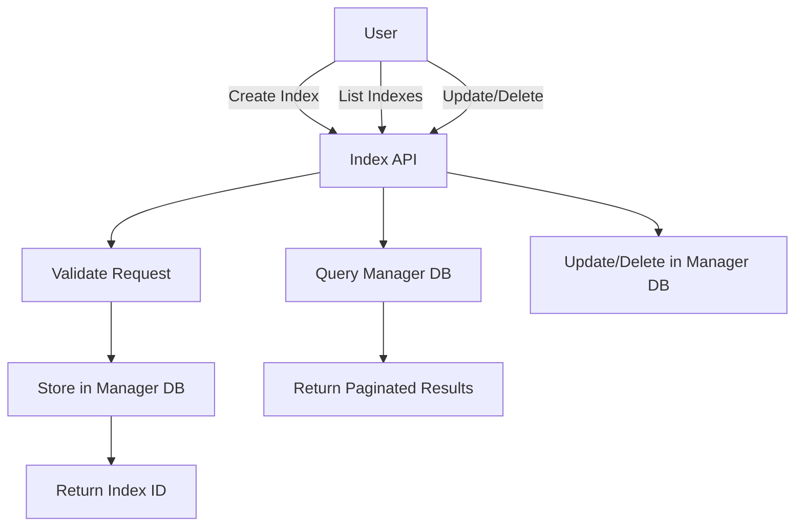
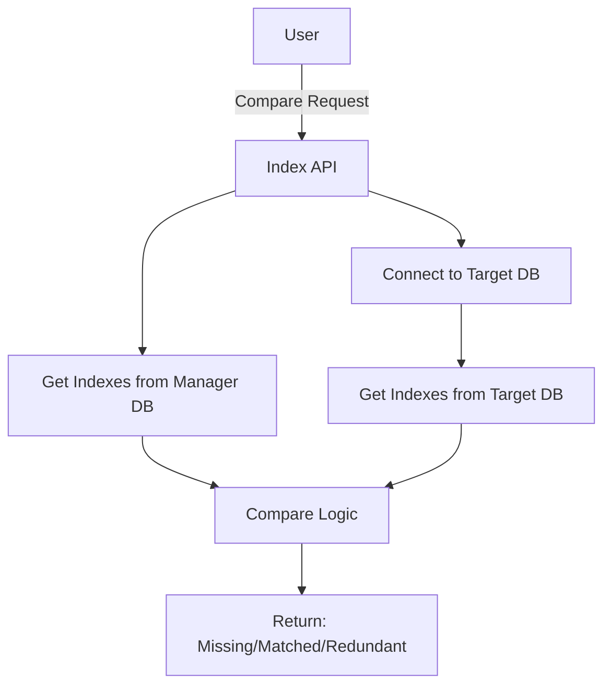
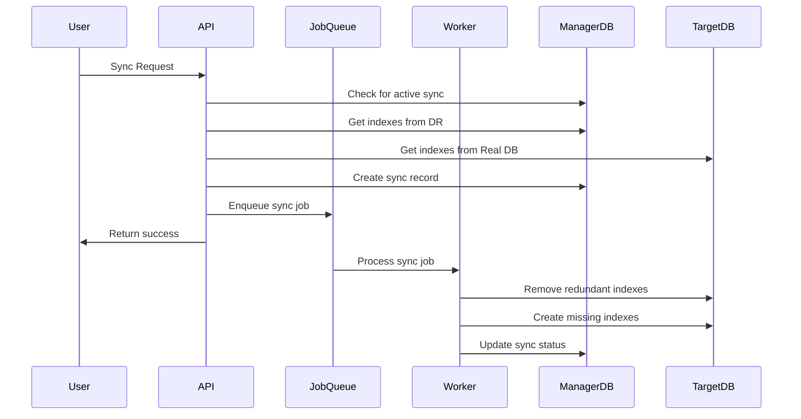

# DRManager - MongoDB Index Manager

## Project Overview

DRManager is a backend API system designed to manage MongoDB indexes across multiple database environments. It provides a centralized way to define, compare, and synchronize indexes between a Design Repository (DR) and real MongoDB databases.

### Purpose

The system allows teams to:
- Define and manage index definitions in a central repository (DR)
- Compare index definitions between DR and actual MongoDB databases
- Synchronize indexes from DR to real databases
- Generate scripts for manual index deployment (planned feature)

## Architecture

### Technology Stack

- **Language**: Go 1.25
- **Web Framework**: Fiber v2.52.9
- **Database**: MongoDB (for both manager storage and target databases)
- **Job Queue**: Redis with Asynq (for async operations)
- **Authentication**: JWT (JSON Web Tokens) with access/refresh token pattern
- **Logging**: Zerolog
- **Validation**: go-playground/validator
- **JSON**: Sonic (high-performance JSON library)

### System Components

```
┌─────────────────────────────────────────────────────────────┐
│                      Client Applications                      │
└──────────────────────────┬──────────────────────────────────┘
                           │
                           │ HTTP/REST API
                           │
┌──────────────────────────▼──────────────────────────────┐
│                    DRManager API Server                      │
│  ┌──────────────┐  ┌──────────────┐  ┌──────────────┐     │
│  │   Auth API   │  │ Database API │  │  Index API   │     │
│  └──────────────┘  └──────────────┘  └──────────────┘     │
│                                                              │
│  ┌────────────────────────────────────────────────────┐   │
│  │          JWT Authentication Middleware              │   │
│  └────────────────────────────────────────────────────┘   │
└──────────────┬──────────────────────┬──────────────────────┘
               │                      │
               │                      │
    ┌──────────▼──────────┐  ┌────────▼──────────┐
    │   Manager MongoDB   │  │   Redis Queue     │
    │   (Index Storage)   │  │   (Job Queue)     │
    └─────────────────────┘  └───────────────────┘
               │
               │
    ┌──────────▼──────────────────────────────────────┐
    │         Target MongoDB Databases                 │
    │  (Real databases to sync indexes to/from)       │
    └──────────────────────────────────────────────────┘
```

### Data Flow

#### Index Management Flow



#### Compare Flow



#### Sync Flow



## Core Features

### 1. Global Index Management (DR)

**Status**: ✅ Implemented

- **Create Index**: Define new index with keys, options (unique, TTL)
- **Read Index**: Get index details by ID
- **List Indexes**: Paginated list of indexes by collection
- **Update Index**: Modify index definition
- **Delete Index**: Remove index from DR

**Key Features**:
- Auto-generates index name from key signature if not provided
- Validates unique index constraints
- Prevents duplicate indexes (by name or key signature)
- Supports compound indexes and TTL indexes

### 2. Compare Indexes

**Status**: ✅ Implemented

- **Compare by Collections**: Compare indexes for specific collections
- **Compare by Database**: Compare all indexes for a database

**Comparison Results**:
- **Missing Indexes**: Indexes in DR but not in Real DB
- **Matched Indexes**: Indexes that exist in both
- **Redundant Indexes**: Indexes in Real DB but not in DR

### 3. Sync Indexes

**Status**: ✅ Partially Implemented

**Current Implementation**:
- **Sync Direction**: DR → Real DB (one-way only)
- **Sync Method**: Asynchronous via Redis job queue
- **Sync Scope**: By collections or entire database
- **Sync Actions**:
  - Creates missing indexes in Real DB
  - Removes redundant indexes from Real DB

**Limitations**:
- ❌ No reverse sync (Real DB → DR)
- ❌ No sync status tracking API
- ❌ No script generation for manual deployment

### 4. Script Generation (Planned)

**Status**: ❌ Not Implemented

**Planned Feature**:
- Generate mongosh scripts from index definitions
- Support for creating indexes via script
- Support for dropping indexes via script
- Export scripts for manual execution in target databases

## API Structure

### Base Path
```
/api/doctor-manager-api/v1
```

### Authentication Endpoints
- `POST /auth/register` - Create user account
- `POST /auth/login` - Get access/refresh tokens
- `POST /auth/refresh-token` - Refresh access token
- `GET /auth/profile` - Get user profile
- `PUT /auth/profile` - Update user profile

### Database Endpoints
- `POST /databases/` - Create database connection
- `GET /databases/:id` - Get database details
- `POST /databases/list` - List databases (paginated)
- `PUT /databases/:id/` - Update database
- `DELETE /databases/:id/` - Delete database
- `POST /databases/collections/list` - List collections

### Index Endpoints
- `POST /indexes/` - Create index
- `GET /indexes/:id` - Get index details
- `POST /indexes/list-by-collection` - List indexes by collection
- `PUT /indexes/:id` - Update index
- `DELETE /indexes/:id` - Delete index
- `POST /indexes/compare-by-collections` - Compare indexes by collections
- `POST /indexes/compare-by-database` - Compare indexes by database
- `POST /indexes/sync-by-collections` - Sync indexes by collections

## Data Models

### Index Model
```go
type Index struct {
    Id                ObjectID
    DatabaseId        ObjectID
    Collection        string
    Name              string
    KeySignature      string  // Auto-generated from keys
    Keys              []IndexKey
    Options           IndexOption
    CreatedAt         time.Time
    UpdatedAt         time.Time
}

type IndexKey struct {
    Field string  // Field name
    Value int32   // 1 for ascending, -1 for descending
}

type IndexOption struct {
    ExpireAfterSeconds *int32  // TTL in seconds
    IsUnique           bool
}
```

### Database Model
```go
type Database struct {
    Id          ObjectID
    Name        string
    Description string
    Uri         string  // MongoDB connection URI
    DBName      string  // Target database name
    CreatedAt   time.Time
    UpdatedAt   time.Time
}
```

### Sync Model
```go
type Sync struct {
    Id          ObjectID
    DatabaseID  ObjectID
    Collections []string
    IsFinished  bool
    Error       string
    CreatedAt   time.Time
    UpdatedAt   time.Time
}
```

## Configuration

### Environment Variables

| Variable | Default | Description |
|----------|---------|-------------|
| `PORT` | 8216 | Server port |
| `HOST` | 0.0.0.0 | Server host |
| `MONGODB_MANAGER_URI` | mongodb://localhost:27017 | Manager DB URI |
| `MONGODB_MANAGER_NAME` | db_manager | Manager DB name |
| `REDIS_ADDRESS` | redis://127.0.0.1:6379 | Redis connection |
| `TOKEN_PUBLIC_KEY_PATH` | certs/public.pem | JWT public key |
| `TOKEN_PRIVATE_KEY_PATH` | certs/private.pem | JWT private key |
| `ACCESS_TOKEN_TIMEOUT` | 10m | Access token expiry |
| `REFRESH_TOKEN_TIMEOUT` | 24h | Refresh token expiry |
| `JOB_CONCURRENCY` | 10 | Job worker concurrency |
| `DEBUG` | false | Debug mode |

## Workflow Examples

### Typical Workflow

1. **Setup Database Connection**
   - User creates database entry with connection URI
   - System validates connection (optional)

2. **Define Indexes in DR**
   - User creates index definitions for collections
   - Indexes stored in Manager DB

3. **Compare Indexes**
   - User compares DR indexes with Real DB
   - System shows differences

4. **Sync Indexes**
   - User triggers sync operation
   - System queues async job
   - Worker syncs indexes to Real DB

### Index Creation Example

```json
POST /api/doctor-manager-api/v1/indexes/
{
  "database_id": "507f1f77bcf86cd799439011",
  "collection": "users",
  "name": "idx_email",
  "options": {
    "is_unique": true
  },
  "keys": [
    { "field": "email", "value": 1 }
  ]
}
```

### Compare Example

```json
POST /api/doctor-manager-api/v1/indexes/compare-by-collections
{
  "database_id": "507f1f77bcf86cd799439011",
  "collections": ["users", "orders"]
}
```

Response shows:
- Missing indexes (in DR, not in Real DB)
- Matched indexes (in both)
- Redundant indexes (in Real DB, not in DR)

## Security

- JWT-based authentication with access/refresh tokens
- Token revocation support
- Password hashing (SHA256)
- Input validation on all endpoints
- SQL injection prevention (using MongoDB driver)

## Deployment

### Requirements
- Go 1.25+
- MongoDB instance (for manager DB)
- Redis instance (for job queue)
- JWT key pair (public.pem, private.pem)

### Docker Support
- Dockerfile included
- Entrypoint script for secret handling
- Supports Kubernetes secret mounts

## Development

### Running Locally

1. Install dependencies:
   ```bash
   go mod download
   ```

2. Setup environment:
   ```bash
   cp .env.example .env
   # Edit .env with your configuration
   ```

3. Generate JWT keys (if not present):
   ```bash
   # Generate keys in certs/ directory
   ```

4. Run with Air (hot reload):
   ```bash
   air
   ```

5. Or run directly:
   ```bash
   go run main.go
   ```

## Notes

- The system uses key signatures to uniquely identify indexes
- Key signature includes: field names, sort orders, unique flag, TTL
- Sync operations are asynchronous and non-blocking
- Only one sync can run per database at a time
- Index names are auto-generated if not provided
